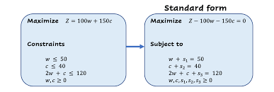

# Simplex Algorithm. Linear Programming

Implementation of the Simplex algorithm in Python.

** Note: This implementation is done to resolve problems with exactly 3 decision variables.
# Introduction

The simplex algorithm is a popular method for solving linear programming problems. Linear programming involves optimizing a linear objective function subject to linear equality and inequality constraints. The simplex algorithm iteratively moves from one feasible solution to another, improving the objective function at each step, until an optimal solution is reached.

Key Steps of the Simplex Algorithm:
#### - Initialize the Simplex Tableau:

Transform the linear programming problem into standard form.
Create the initial simplex tableau.


#### - Identify the Pivot Element:

Choose a pivot column based on the most negative coefficient in the objective function (if maximizing)
#### - Determine the Pivot Row:

Find the pivot row by selecting the minimum ratio of the right-hand side to the pivot column element.
#### - Update the Tableau:

Use the pivot element to perform row operations, bringing the pivot column to the unit vector and zeroing other elements in the pivot column.


#### - Iterate Until Optimality:

Repeat steps 2-4 until no negative coefficients exist in the objective row, indicating an optimal solution.

# Installation

The only requisite to install this implementation would be git. Then: 

```bash
git clone https://github.com/pepe-olivert/simplex_algorithm.git
```

## Overview

This Python script implements the simplex algorithm for solving linear programming problems. The algorithm is designed to find the optimal solution to a given linear objective function subject to linear constraints.


## Usage

#### - Requirements

Please ensure to have python installed in your machine. Numpy will be needed too.

#### - Run the script

In the simplexAlgorithm.py, insert the data from your problem, as it is below:

```python
r1 = np.array([1,2,3/2,1,0,0,12000],dtype=float)
r2= np.array([2/3,2/3,1,0,1,0,4600],dtype=float)
r3 = np.array([1/2,1/3,1/2,0,0,1,2400],dtype=float)
r4=np.array([-11,-16,-15,0,0,0,0],dtype=float)
rows = [r1,r2,r3,r4]
```

Next thing you will have to do is, in the console:


```bash
python3 simplexAlgorithm.py
```

And you will get the optimal solution.

## Contributing

Pull requests are welcome. For major changes, please open an issue first
to discuss what you would like to change.
